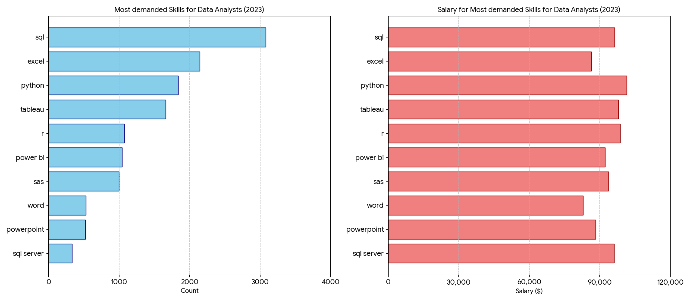
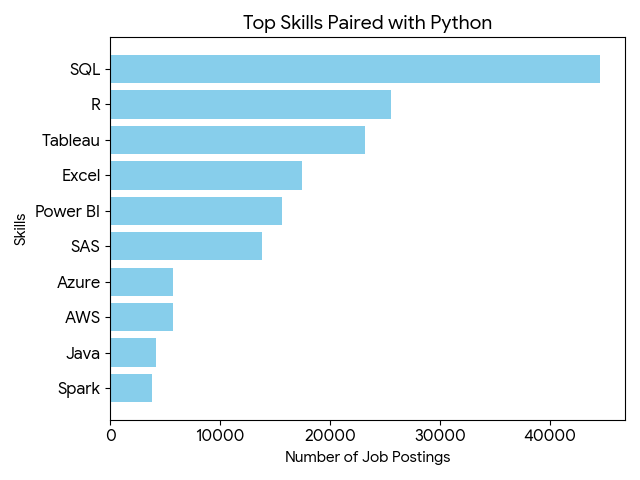
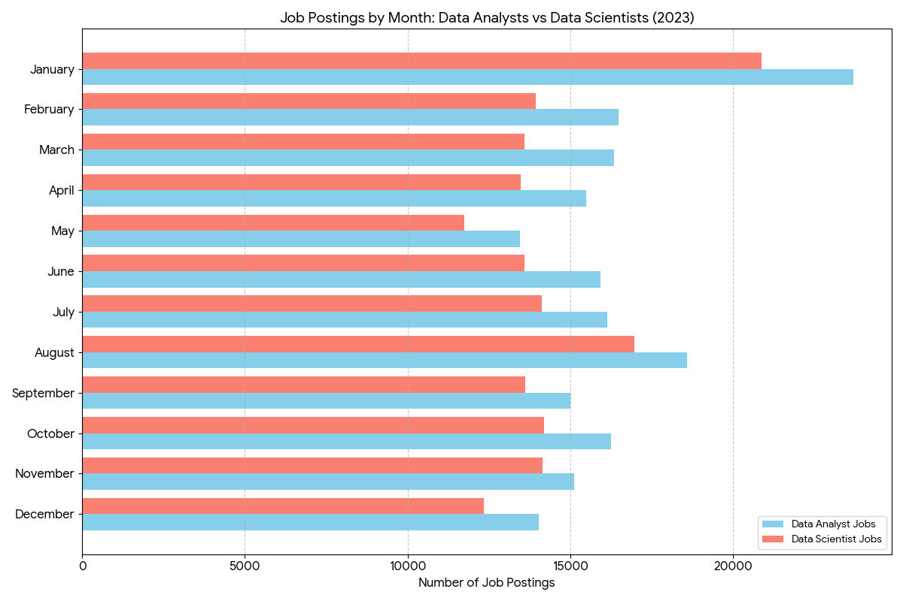

# Introduction
Data Analyst has been on the roles with the most growth in recent years. Cleaning data, telling stories with data visualization, analyze, provide meaningful insights and making decisions based on the analyzed data has become a really important skill even in a world where AI is on the rise. 

In this project, it is analyzed data regarding jobs for the Data Science field posted during 2023. The main focus of this project is for Data Analyst roles and Data Scientist roles.

SQL queries: [project_sql folder](/project_sql/)

# Background
This project comes from the desire to jump into the Data Analyst field. The purpose of this project is to show SQL proficiency to potential employers.
To achieve this purpose this project shows and analizes data regarding different job positions during 2023. While it's not the most recent data; it should be enough to fullfill the purpose of this project.

The dataset used for this project contains data from a lot of countries. Although most of them are from the United States and other developed countries. Results when it comes to salary are much higher to what is offered in Latin American countries. Take this into consideration. 

This porjects answer the following questions:
- 1. Top Demanded Skills for Data Analysts.
- 2. Top Paying Skills for Data Analysts.
- 3. Onsite vs Remote Jobs salary
- 4. Optimal Skill "Bundles
- 5. Hiring Patterns by Month

# Tools I used
- **SQL:** Language used to managed data.
- **PostgreSQL:** Powerful open source database system.
- **PgAdmin:** open-source administration and development platform for PostgreSQL
- **Visual Studio Code:** Code editor developed by Microsoft capable of handling different coding languages. 


# The Analysis

### **1. Top Demanded Skills for Data Analysts:**
To identify the top demanded skills for data analyst I filtered by the role of 'Data Analyst' and salary year average. Taking only into consideration the jobs that actually show a salary in their job description. The objective of this question is to show the job seekers what skills to learn to jump on the Data Analyst field.

```sql
SELECT 
	sd.skills,
	COUNT(*) AS skill_count,
	ROUND(AVG(jpf.salary_year_avg),2) AS avg_salary
FROM job_postings_fact jpf
INNER JOIN skills_job_dim sjd ON jpf.job_id = sjd.job_id
INNER JOIN skills_dim sd ON sjd.skill_id = sd.skill_id
WHERE
	job_title_short = 'Data Analyst' AND
	salary_year_avg IS NOT NULL
GROUP BY
		skills
HAVING
	COUNT(*) > 10
ORDER BY 
	skill_count DESC
LIMIT 10;
```

| Skill | Skill Count | Average Salary |
| :--- | :---: | :--- |
| **SQL** | 3,083 | $96,435.33 |
| **Excel** | 2,143 | $86,418.90 |
| **Python** | 1,840 | $101,511.85 |
| **Tableau** | 1,659 | $97,978.08 |
| **R** | 1,073 | $98,707.80 |
| **Power BI** | 1,044 | $92,323.60 |
| **SAS** | 1,000 | $93,707.36 |
| **Word** | 527 | $82,940.76 |
| **Powerpoint** | 524 | $88,315.61 |
| **SQL Server** | 336 | $96,191.42 |

- Highest Paid: Python leads with an average salary of $\$101,512$, followed closely by R ($\$98,708$) and Tableau ($\$97,978$).
- The SQL Standard: Proficiency in SQL and SQL Server both command strong mid-range salaries between $\$96,000$ and $\$96,500$.
- Foundational Tools: Skills like Word and Excel sit at the
lower end of the spectrum, with averages of $\$82,941$ and $\$86,419$ respectively.


*Chart 1: Top Demanded Skills for Data Analysts vs Salaries*

### **2. Top Paying Skills for Data Analysts:**
To identify the top paying skills the data was filtered again by role 'Data Analyst' and by the salary. The difference this time is that this time the results where ordered by salary year average.
```sql
SELECT 
	sd.skills,
	COUNT(*) AS skill_count,
	ROUND(AVG(jpf.salary_year_avg),2) AS avg_salary
FROM job_postings_fact jpf
INNER JOIN skills_job_dim sjd ON jpf.job_id = sjd.job_id
INNER JOIN skills_dim sd ON sjd.skill_id = sd.skill_id
WHERE
	job_title_short = 'Data Analyst' AND
	salary_year_avg IS NOT NULL
GROUP BY
		skills
HAVING
	COUNT(*) > 10
ORDER BY 
	avg_salary DESC
LIMIT 10;
```

| Skill | Skill Count | Average Salary |
| :--- | :---: | :--- |
| **Kafka** | 40 | $129,999.16 |
| **PyTorch** | 20 | $125,226.20 |
| **Perl** | 20 | $124,685.75 |
| **TensorFlow** | 24 | $120,646.83 |
| **Cassandra** | 11 | $118,406.68 |
| **Atlassian** | 15 | $117,965.60 |
| **Airflow** | 71 | $116,387.26 |
| **Scala** | 59 | $115,479.53 |
| **Linux** | 58 | $114,883.20 |
| **Confluence** | 62 | $114,153.12 |


- Skills like 'kafka' and 'pytorch' have higher average salaries. They certainly are very specific skills for seniors and jobs that may not be necessarily be for Data Analyst
even if they were tagged as roles for 'Data Analyst' in our dataset. 
- They command significantly higher average salaries, with most exceeding $\$115,000$. This highlights a "niche premium" where specialized technical expertise (in Big Data, Machine Learning, and Infrastructure) leads to higher compensation despite lower overall job volume.
- 'SQL' and 'Python' remain the most critical skills to learn first due to their massive market demand as it
was shown in our first query.

### **3. Onsite vs Remote Jobs salary:**
To answer this the data was filtered by job title and salary. Again only jobs with a salary in their job description where taking into consideration for this question. Then using case the data was filter by remote and onsite jobs to get the average.

```sql
SELECT
	job_title_short,
	COUNT(job_id) AS job_count,
	ROUND(AVG(CASE WHEN job_work_from_home = true THEN salary_year_avg END),2) AS remote_avg_salary,
	ROUND(AVG(CASE WHEN job_work_from_home = false THEN salary_year_avg END),2) AS onsite_avg_salary
FROM
	job_postings_fact
WHERE
	salary_year_avg IS NOT NULL
GROUP BY
	job_title_short
ORDER BY
	job_count DESC
LIMIT 5;
```

| Job Title | Job Count | Remote Avg Salary | On-site Avg Salary |
| :--- | :---: | :--- | :--- |
| **Data Scientist** | 5,926 | $144,398.25 | $134,306.56 |
| **Data Analyst** | 5,463 | $94,769.86 | $93,764.65 |
| **Data Engineer** | 4,509 | $132,363.57 | $129,846.53 |
| **Senior Data Scientist** | 1,686 | $163,798.16 | $151,632.84 |
| **Senior Data Engineer** | 1,594 | $148,245.25 | $145,364.45 |

- Interestingly, for every role listed, the remote average salary is higher than the onsite average. 
- Moving from a "Data Scientist" to a "Senior Data Scientist" yields a significant remote pay bump of roughly $\$19,400$.
- While Data Analysts have a high job count (high demand), the salary ceiling is lower compared to Engineers and Scientists, suggesting a pivot to Data Engineering might be more lucrative long-term.


### **4. Optimal Skill "Bundles" for Data Analysts:**
To answer this the data was filtered by skills and job title. With a CTE the data was filtered to get all jobs that require Python. All jobs were used for this question even if they don't specify a salary. The CTE was joined to the main query to get the most bundled skill with Python.

```sql
WITH python_jobs AS(
	SELECT 
	jpf.job_id
FROM job_postings_fact jpf
INNER JOIN skills_job_dim sjd ON jpf.job_id = sjd.job_id
INNER JOIN skills_dim sd ON sjd.skill_id = sd.skill_id
WHERE
	job_title_short = 'Data Analyst' AND
	LOWER(skills) = 'python'
)

SELECT 
	sd.skills,
	COUNT(*) AS skill_count
FROM skills_job_dim sjd
INNER JOIN skills_dim sd ON sjd.skill_id = sd.skill_id
WHERE sjd.job_id IN (
	SELECT job_id
	FROM python_jobs
) AND LOWER(sd.skills) <> 'python'
GROUP BY
	sd.skills
ORDER BY
	skill_count DESC
LIMIT 10;
```

| Skill | Job Count (Paired with Python) |
| :--- | :--- |
| **SQL** | 44,630 |
| **R** | 25,588 |
| **Tableau** | 23,233 |
| **Excel** | 17,492 |
| **Power BI** | 15,644 |
| **SAS** | 13,844 |
| **Azure** | 5,712 |
| **AWS** | 5,690 |
| **Java** | 4,123 |
| **Spark** | 3,795 |

- SQL is the clear winner, paired with Python in over 44,000 postings. This confirms that knowing how to extract data (SQL) is just as important as knowing how to process it (Python).
- The high count for R (25,588) suggests a heavy overlap in Data Science roles where both languages are often expected or interchangeable for statistical modeling.
- Tableau is paired with Python significantly more often than Power BI (approx. 23k vs 15k). This might indicate that certain industries favoring Tableau also favor Python.


*Chart 2: Top Skills Paired with Python*

### **5. Hiring Patterns by Month**

```sql
WITH monthly_jobs AS(
	SELECT
		job_id,
		job_title_short,
		EXTRACT(MONTH FROM job_posted_date) AS month_,
		TO_CHAR(job_posted_date, 'Month') AS month_name
	FROM job_postings_fact
	WHERE job_title_short IN ('Data Analyst', 'Data Scientist')	
)

SELECT
	month_,
	month_name,
	COUNT(CASE WHEN job_title_short = 'Data Analyst' THEN 1 END) AS data_analysts_jobs,
	COUNT(CASE WHEN job_title_short = 'Data Scientist' THEN 1 END) AS data_Scientist_jobs
FROM monthly_jobs mj
GROUP BY
	mj.month_,
	mj.month_name
ORDER BY
	month_
```
| Month | Data Analyst Jobs | Data Scientist Jobs |
| :--- | :---: | :---: |
| **January** | 23,697 | 20,875 |
| **February** | 16,479 | 13,952 |
| **March** | 16,342 | 13,603 |
| **April** | 15,499 | 13,489 |
| **May** | 13,457 | 11,752 |
| **June** | 15,932 | 13,606 |
| **July** | 16,150 | 14,126 |
| **August** | 18,602 | 16,977 |
| **September** | 14,997 | 13,630 |
| **October** | 16,260 | 14,202 |
| **November** | 15,133 | 14,158 |
| **December** | 14,045 | 12,356 |

- There is a clear peak in job postings for both roles in January, followed by a notable dip in May and December, likely due to seasonal hiring cycles.


*Chart 3: Job Postings by Month*

# What I learned
- Analytical skills to solve real life questions and turning them into queries.
- Use of aggregation functions like AVG and COUNT and GROUPBY to get meaningful results.
- Experience and confidence in building more complex queries.

# Conclusions
- SQL is the foundation to get into the Data Analysts field. Combining it with other tools like a visualization tool and Python really makes a great combo and potential growth in this industry.
- Since the data is from 2023 is difficult to tell if AI tools are affecting this trend. Although some sources on the internet say that probably it'll affect entry level jobs.
- Data Analyst has a great field for expansion. Tools like Python can also be used in other fields like Machina Learning and AI. Providing the user of these skills several fields to work.


